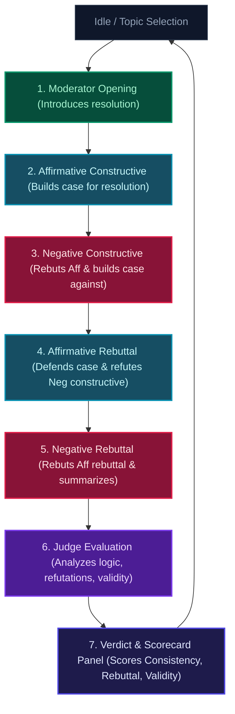

# ⚖️ DEEBATE — Formal AI Debate Arena

[](https://nextjs.org/)
[](https://react.dev/)
[](https://tailwindcss.com/)
[](https://www.typescriptlang.org/)
[](https://openai.com/)
[](https://opensource.org/licenses/MIT)

**DEEBATE** is a premium, multi-agent Lincoln-Douglas structured AI debate simulation platform. It orchestrates a formal debate between Affirmative and Negative AI agents, overseen by an AI Moderator, timed by a virtual Timekeeper, and evaluated by an expert AI Judge.

The application is built on a cutting-edge frontend stack: **Next.js 16.2 (App Router)**, **React 19**, and **Tailwind CSS v4**, powered by **AI Language Models** (via any OpenAI-compatible API) to stream responses in real-time.

---

## 🌟 Key Features

- **Structured Lincoln-Douglas Format**: Supports a complete 6-stage formal debate flow:
  1. **Moderator Opening**: Introduces the resolution neutrally.
  2. **Affirmative Constructive**: Builds the foundational case in favor of the resolution (under 150 words).
  3. **Negative Constructive**: Rebuts the Affirmative case and builds the counter-arguments (under 150 words).
  4. **Affirmative Rebuttal**: Defends the original case and refutes Negative points (under 100 words).
  5. **Negative Rebuttal**: Delivers the final summary and closing arguments (under 100 words).
  6. **Judge Evaluation**: Evaluates the transcript to declare the winner and provide a structural breakdown.
- **Real-Time Streaming**: Streamed token-by-token text generation from LLMs using Web Streams, providing immediate, live interaction.
- **Crystal Bell Audio System**: Synthesizes a realistic crystal bell chime using the **Web Audio API** (no static audio file downloads required) to announce time expiration/turn transitions.
- **Verdict & Scorecard Panel**: Generates a dynamic scorecard rating both sides on **Consistency**, **Rebuttal**, and **Practical Validity** alongside the judge's formal analysis.
- **Premium Dark-Theme Interface**: A futuristic dashboard leveraging a glassmorphic aesthetic, custom neon glows, smooth micro-animations, and custom fonts (*Outfit* & *Plus Jakarta Sans*).
- **Interactive Controls**:
  - Live resolution editing and preset topic quick-start buttons.
  - Autoscroll locking toggle and audio chime mute switch.
  - One-click script exporter to copy the full debate transcript formatted in Markdown.

---

## ⚙️ How It Works: The Debate Flow

The debate follows a strict sequential flow orchestrated on the client-side (`app/page.tsx`). Each phase transitions automatically and is tracked on a visual timeline:



Transition details:
- **Client as Orchestrator**: The React client runs the core state machine, managing speaker durations and fetching streamed API responses sequentially.
- **Timekeeper Chime**: End of speaker turns triggers a physical synthesized sound using the Web Audio API and posts a timekeeper notice in the feed.

---

## 🛠️ Architecture & Tech Stack

- **Framework**: [Next.js 16.2](https://nextjs.org) (App Router)
- **Library**: [React 19](https://react.dev) (Functional client-side state, refs, and effects)
- **Styling**: [Tailwind CSS v4](https://tailwindcss.com) (leveraging new `@theme` configuration directives, native PostCSS integrations, and modern CSS properties)
- **Backend API**: Next.js Route Handlers streaming data using the standard `OpenAI` client SDK.
- **Typography**: Google Fonts (*Outfit* for headlines and display, *Plus Jakarta Sans* for body text)

---

## 🔍 Technical Deep Dive

### 1. Streaming API Integration (`/api/debate`)

To deliver a responsive typing effect, completions are streamed delta-by-delta using **Web Streams**. The API endpoint accepts standard chat messages, system prompt contexts, and configuration parameters, generating an asynchronous chunk-by-chunk UTF-8 stream.

**Backend Implementation (`app/api/debate/route.ts`):**
```typescript
import { OpenAI } from "openai";

const openai = new OpenAI({
  baseURL: process.env.BASE_URL,
  apiKey: process.env.OPENAI_TOKEN,
});

export async function POST(req: Request) {
  const { messages, systemPrompt, model, maxTokens } = await req.json();

  const response = await openai.chat.completions.create({
    model: model,
    messages: [
      { role: "system", content: systemPrompt },
      ...messages
    ],
    stream: true,
    max_completion_tokens: maxTokens,
  });

  const stream = new ReadableStream({
    async start(controller) {
      for await (const chunk of response) {
        const text = chunk.choices[0]?.delta?.content || "";
        if (text) {
          controller.enqueue(new TextEncoder().encode(text));
        }
      }
      controller.close();
    }
  });

  return new Response(stream, {
    headers: {
      "Content-Type": "text/plain; charset=utf-8",
      "Cache-Control": "no-cache",
      "Connection": "keep-alive"
    },
  });
}
```

**Frontend Consumption (`app/page.tsx`):**
```typescript
const reader = res.body.getReader();
const decoder = new TextDecoder();
let fullResponse = "";

while (true) {
  const { done, value } = await reader.read();
  if (done) break;
  const chunk = decoder.decode(value, { stream: true });
  fullResponse += chunk;
  
  setMessages((prev) => 
    prev.map((msg) => msg.id === messageId ? { ...msg, content: fullResponse } : msg)
  );
}
```

---

### 2. Crystal Bell Audio Synthesizer

Rather than making HTTP requests to download static `.wav` or `.mp3` sound files, the platform synthesizes its transition chime client-side using the **Web Audio API**. It uses additive synthesis to mimic a clean physical bell strike.

- **Primary Tone**: A sine wave oscillator tuned to `587.33 Hz` (D5 note).
- **Harmonic Fifth**: A second sine wave oscillator tuned to `880.00 Hz` (A5 note) provides high-end resonance.
- **Envelope Control**: A `GainNode` schedules an instantaneous attack followed by an exponential decay to silence over `1.8` seconds.

```typescript
const ctx = new AudioContext();
const osc1 = ctx.createOscillator();
const osc2 = ctx.createOscillator();
const gainNode = ctx.createGain();

osc1.type = "sine";
osc1.frequency.setValueAtTime(587.33, ctx.currentTime);

osc2.type = "sine";
osc2.frequency.setValueAtTime(880.00, ctx.currentTime);

gainNode.gain.setValueAtTime(0, ctx.currentTime);
gainNode.gain.linearRampToValueAtTime(0.2, ctx.currentTime + 0.05); // Attack
gainNode.gain.exponentialRampToValueAtTime(0.0001, ctx.currentTime + 1.8); // Decay

osc1.connect(gainNode);
osc2.connect(gainNode);
gainNode.connect(ctx.destination);

osc1.start();
osc2.start();
osc1.stop(ctx.currentTime + 1.8);
osc2.stop(ctx.currentTime + 1.8);
```

---

### 3. Custom Inline Markdown Parser

To handle styling on the fly during real-time streaming, DEEBATE uses a custom, lightweight, regex-free parser that constructs React Virtual DOM trees directly. This avoids expensive re-renders and prevents cross-site scripting (XSS) issues common with `dangerouslySetInnerHTML`.

- **Block Renderer (`renderMarkdown`)**: Matches and formats paragraphs, lists (`- ` or `* `), headers (`#` through `####`), and horizontal rules (`---`).
- **Inline Parser (`parseInline`)**: Recursively splits chunks by `**` (for bold text) and `` ` `` (for monospaced code blocks), rendering corresponding dynamic elements on the fly.

---

## 📁 File Structure

```text
deebate/
├── app/                  # Main Next.js Application source code
│   ├── api/              # API Route Handlers
│   │   └── debate/
│   │       └── route.ts  # Stream handler targeting the inference endpoint
│   ├── globals.css       # Theme tokens, custom animations & Tailwind imports
│   ├── layout.tsx        # App root layout, font configuration, and metadata
│   └── page.tsx          # Main debate arena dashboard state & UI components
├── public/               # Static icons, logos, and images
├── .env                  # Environment configurations (tokens and endpoints)
├── .gitignore            # Git exclusion patterns
├── AGENTS.md             # Next.js system/agent constraints
├── CLAUDE.md             # Developer instructions map
├── eslint.config.mjs     # ESLint code style rules
├── next-env.d.ts         # Next.js compilation type declarations
├── next.config.ts        # Next.js framework configuration
├── package.json          # Dependency specifications and run scripts
├── postcss.config.mjs    # PostCSS rules for Tailwind CSS v4
└── tsconfig.json         # TypeScript compiler configurations
```

---

## 🚀 Getting Started

### Prerequisites

Ensure you have **Node.js 18+** and **npm** installed on your system.

### 1. Configure Environment Variables

Create a `.env` file in the root of the project to set up the connection details. Since the API handler leverages the standard OpenAI client SDK, it can be configured to point to **any OpenAI-compatible endpoint** (such as OpenAI, local Ollama, vLLM, or GitHub Models):

```env
OPENAI_TOKEN="your_api_key_or_token_here"
BASE_URL="https://api.openai.com/v1" # Or your custom provider endpoint
```

### 2. Install Dependencies

Install the packages using npm:

```bash
npm install
```

### 3. Run the Development Server

Start the local server:

```bash
npm run dev
```

Open [http://localhost:3000](http://localhost:3000) in your browser to view the application.

### 4. Build for Production

To create and run an optimized production build:

```bash
npm run build
npm run start
```

---

## ⚖️ Debate Flow Specifications

Each stage of the debate is configured with strict instructions to keep the simulation paced and competitive:

| Stage | Speaker | Instructions & Pacing | Max Tokens | Model |
| :--- | :--- | :--- | :--- | :--- |
| **1** | **Moderator** | Neutrally introduce the debate resolution (Max 2 sentences). | 120 | `gpt-4o-mini` |
| **2** | **Affirmative (Constructive)** | Build the case FOR the topic with 2 distinct arguments (Under 150 words). | 300 | `gpt-4o-mini` |
| **3** | **Negative (Constructive)** | Build the case AGAINST the topic, present 2 counter-arguments, and challenge 1 Affirmative point (Under 150 words). | 300 | `gpt-4o-mini` |
| **4** | **Affirmative (Rebuttal)** | Defend original case and aggressively dismantle the Negative constructive points (Under 100 words). | 200 | `gpt-4o-mini` |
| **5** | **Negative (Rebuttal)** | Dismantle Affirmative's rebuttal and summarize why Negative wins (Under 100 words). | 200 | `gpt-4o-mini` |
| **6** | **Judge Panel** | Evaluate the transcript based on logic, directness of refutations, and practical validity. Declare a single winner (Affirmative or Negative) and break down the decision. | 1000 | `gpt-4o` |

---

## 🎨 Design System

All custom CSS variables and UI rules are defined inside `app/globals.css`:

- **Theme Colors (Tailwind v4 `@theme`)**:
  - Background: `#07080e` (layered indigo/rose radial gradient meshes)
  - Cards: `rgba(13, 16, 27, 0.45)` with a backdrop blur of `12px` (glassmorphic styling)
  - Affirmative Glow (`glow-cyan`): `#06b6d4`
  - Negative Glow (`glow-rose`): `#f43f5e`
  - Moderator Glow (`glow-emerald`): `#10b981`
  - Timekeeper Notice (`glow-amber`): `#f59e0b`
  - Judge Glow (`glow-violet`): `#8b5cf6`
- **Animations**:
  - `pulse-active`: Subtle pulsing glow representing the active speaker phase in the timeline.
  - `typingBounce`: Bouncing dots indicating that a streaming completions chunk is being fetched or prepared.
  - Glass panel hover transitions and glowing neon border shadows.

---

## 📄 License

Distributed under the MIT License. See `LICENSE` for more information.
